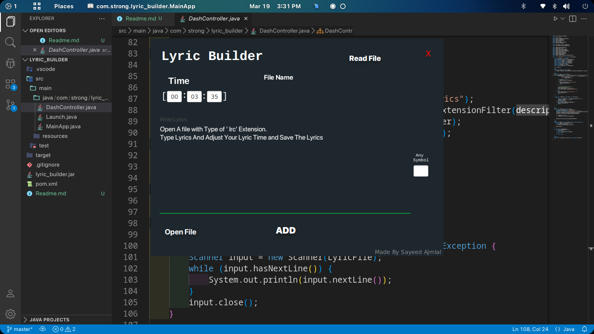
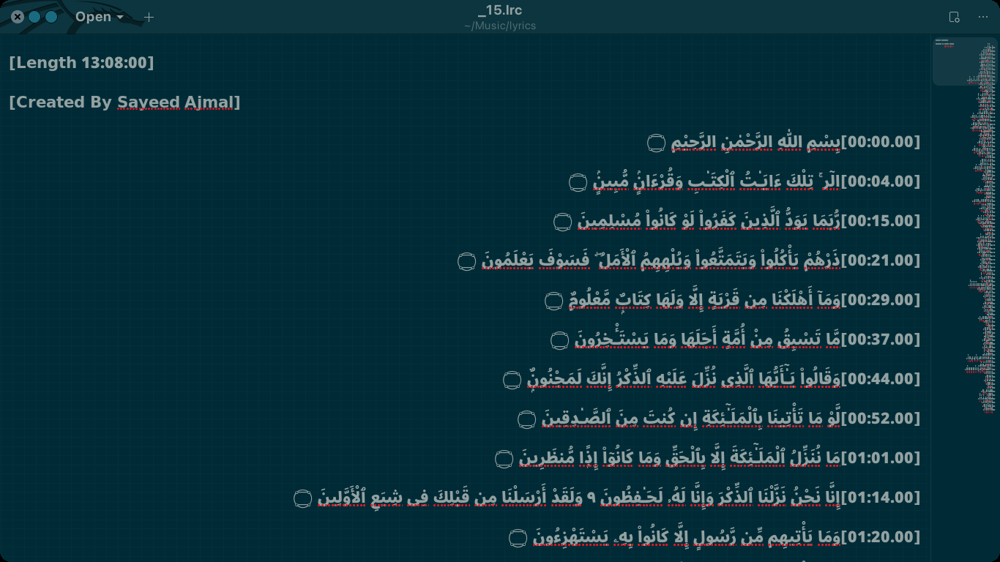

# Lyric Builder For Desktop

## USE

* Create a text file with the .lrc extension.
* Open Jar file by type java -jar lyric_builder.jar
* Open which file you are created.
* Type the lyric and adjust yYour lyrics time According Music.
* Add symbol in last if you have any.
* Click Save To Feed The Lyrics.

# EXAMPLE

